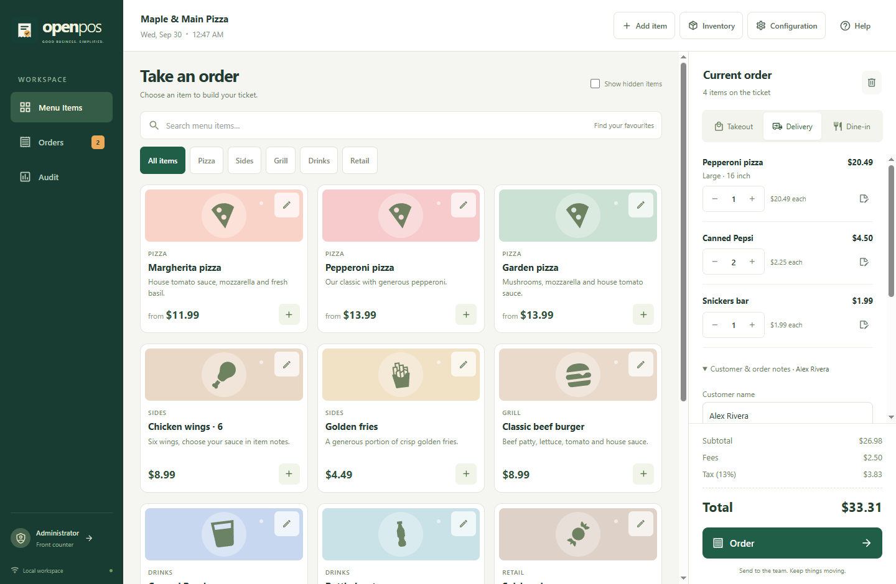

# OpenPOS


**A clearer counter. A connected kitchen.**



An open-source, touch-friendly Windows order application for independent pizza shops, takeout restaurants and small retailers. Take an order, choose sizes, add fees, print its receipt and keep a kitchen screen up to date over your private network.

| 🍕 Serve your menu               | 🧾 Keep service moving                      | 📊 Understand the day                  |
| -------------------------------- | ------------------------------------------- | -------------------------------------- |
| Simple products, sizes and types | In-progress and completed orders            | Date-filtered completed sales          |
| Search and category filters      | Order corrections and cancellation          | Best sellers by quantity or revenue    |
| Optional ingredient recipes      | Printable receipts and retail auto-complete | Stock receiving and movement reporting |

**Your business, your setup:** configurable tax, fees, currency and receipt details; password-protected administration; readable local JSON data; backup/export tools; and the same installer for counter and kitchen devices.

[Visual product overview](docs/sales.html) · [Business handbook](docs/help.html) · [Architecture](docs/architecture.html) · [Implementation decisions](docs/implementation.html) · [Acceptance map](docs/acceptance.html)

OpenPOS records orders and sales totals. Card processing, payment-terminal integration and cash-drawer control are not included. Connected clients require the master to be running. See the [operational boundaries](docs/implementation.html#limitations) before live deployment.

## Quick start for developers

Target: **Windows 10 x64 or newer**. Install **Node.js 22.12+ or Node.js 24 LTS** (below 25), Git, and **Yarn Classic 1.22.22**. End users of the packaged app do not need Node or Yarn.

1. Clone [the OpenPOS repository](https://github.com/EthannYakabuski/OpenPOS), or download and extract its source archive:

   ```powershell
   git clone https://github.com/EthannYakabuski/OpenPOS.git
   cd OpenPOS
   ```

2. Open a terminal in the repository folder.
3. If Yarn is not already installed, run `npm install --global yarn@1.22.22`.
4. Install dependencies and start the development application:

```powershell
yarn install
yarn dev
```

The first run shows a demonstration pizza shop with multiple pizza sizes, canned Pepsi, Snickers, stock records and completed/in-progress orders. Development uses **`.dev-data` inside the repository** so your ordinary shop folder stays separate. The development runner builds and launches the actual Electron application.

To launch a production build locally:

```powershell
yarn build
yarn start
```

Normal launches use **`%USERPROFILE%\.openpos`**. First launch creates this folder and seeds sample data. Use a separate test data folder and the protected **Start fresh** action before real trading; do not count demonstration sales as business revenue.

## Build a Windows installer

```powershell
yarn dist
```

The NSIS installer is produced at `release/OpenPOS-0.1.0-Setup-x64.exe`. It installs per machine and creates desktop and Start menu shortcuts. The application initializes each Windows user’s `.openpos` data on first launch, avoiding the administrator-profile problem that can occur when an elevated installer writes user data.

`yarn pack` produces an unpacked Windows application for local verification. Installation requires elevation when Windows requests it. No public download URL or code-signing certificate is bundled; publish built installers through your chosen release process and configure signing before broad distribution.

## Verify changes

The initial Windows build passed **41 unit/integration tests and all 6 desktop workflows against the packaged executable**. See the [verification record](docs/verification.html) for scope and hardware checks still needed before live use.

```powershell
yarn typecheck
yarn test
yarn build
yarn test:e2e
```

Or run the full sequence with `yarn verify`. `yarn test:watch` runs unit tests during development. The desktop end-to-end suite launches Electron and uses isolated test data. Physical touchscreen, receipt-printer, installer-elevation and two-device network checks still belong in release validation on the intended hardware.

| Command                             | Purpose                                                  |
| ----------------------------------- | -------------------------------------------------------- |
| `yarn dev`                          | Build and launch the development app using `.dev-data`   |
| `yarn build:dev`                    | Compile an unminified development build                  |
| `yarn build`                        | Compile and assemble production assets and bundled help  |
| `yarn start`                        | Launch the already-built app with the normal data folder |
| `yarn typecheck`                    | Check TypeScript contracts                               |
| `yarn test` / `yarn test:watch`     | Run unit/integration tests once or continuously          |
| `yarn test:e2e`                     | Run the actual desktop workflow checks                   |
| `yarn verify`                       | Type checking, tests, build and desktop checks           |
| `yarn pack` / `yarn dist`           | Create an unpacked app or NSIS installer                 |
| `yarn format` / `yarn format:check` | Format the maintained source or check its formatting     |

## Set up a shop

1. Explore the demonstration catalog, orders, stock and reports.
2. Open **Configuration → Security** and set an administrator password. Unlock administrator access to maintain the menu, stock, settings and Audit.
3. Under **Business**, set your business name, percentage tax, optional fees and receipt footer. Enable inventory if useful. Enable **Auto Complete Orders** for immediate retail sales; leave it off for kitchen preparation.
4. Use **Add item** or a menu card’s pencil to customize the catalog. Give variants their own full prices. Optionally link each product to inventory items and consumption quantities.
5. When ready to leave the sample data behind, use **Start fresh** in Configuration and type `START FRESH`. It creates a backup, clears orders and stock movement history, and zeros stock while retaining your catalog and configuration. Choose your currency while the ledger is empty, then enter your real opening inventory. Supported currencies are CAD, USD, EUR, GBP, AUD and NZD; currency changes are blocked while order history exists.
6. Check a test order, its tax/fees, stock effect and printed receipt before opening for service. Lock administrator access when done.

The [business handbook](docs/help.html) is written for staff and owners. It is bundled with the installer and opens in the default browser through **Help**.

## Connect the kitchen

For one device, keep **Standalone** selected in Configuration. For a private local network:

- On the counter computer, configure **Master**, set an administrator password and a random sync key of at least 24 characters, and choose a listening port.
- On each kitchen computer, configure **Client**, enter the master’s HTTP address and the same sync key, and choose **Orders** as the starting tab.
- Set a local password before pairing a client so its connection settings can be repaired offline. While connected, unlock the client using the master’s administrator password; the unlock affects only that device.
- Register each client’s exact identifier on the master. Permit the selected port on the trusted private network if Windows Firewall requires it.
- Verify that an order created at the counter appears in the kitchen, and that completing it updates the counter and stock.

The master owns the shared data. Clients submit authenticated commands and refresh authoritative snapshots; they do not merge independent databases or write offline. Out-of-date edits are rejected for review. Requests are signed and replay-checked, but the transport is **HTTP without encryption**. Keep it on a trusted private network; do not forward the port to the public internet.

## Data and customization

Business files in the active data folder:

| File                      | Meaning                                                                                |
| ------------------------- | -------------------------------------------------------------------------------------- |
| `menu.json`               | Menu products, variants, prices and recipes                                            |
| `inventory.json`          | Stock items, balances, units and low-stock thresholds                                  |
| `orders.json`             | Order history, captured prices and statuses                                            |
| `movements.json`          | Stock receipts, consumption, adjustments and reversals                                 |
| `config.json`             | Shared business settings                                                               |
| `metadata.json`           | Schema and revision information                                                        |
| `device.json`             | Local role, preferred tab, registration and connection settings                        |
| `auth.json`               | Local administrator password verification data                                         |
| `events.ndjson`           | Structured operational events, one JSON record per line                                |
| `logs/application.ndjson` | Desktop process diagnostics                                                            |
| `client-cache.json`       | Last accepted master snapshot on a client; never uploaded as independent business data |
| `instance.lock`           | Prevents two processes from opening the same data folder                               |
| `transaction.json`        | Application-managed recovery file when a transaction is pending                        |
| `backups/`                | Exported business-state backups                                                        |

**Prices in JSON are integer cents:** `250` is 2.50 in the interface. Tax is a percentage: `13` is 13%. A variant has a full price; its nonempty recipe overrides the base recipe, and an empty recipe inherits the base recipe.

The master or standalone app watches `menu.json`; valid manual changes refresh the menu automatically. Invalid edits preserve the last accepted screen state and show a warning. Keep stable unique IDs and required fields, and follow the complete [JSON example](docs/help.html#manual-json). Use application workflows for order and inventory changes so totals and movement history stay coherent. Do not manually edit transaction or metadata files.

For recovery, use Configuration’s backup action and keep protected dated copies. A closed-app copy of the entire `.openpos` folder is the full device backup; business-state exports do not include local credentials and device settings. In connected mode, back up the authoritative master. Do not mix files from different backup dates.

## Project structure and technical choices

```text
src/
  core/       Domain rules, validation, JSON store and demo data
  main/       Electron lifecycle, service, LAN sync, preload and receipts
  renderer/   React workspaces, dialogs and styling
  shared/     Typed contracts between processes
assets/       Application mark and generated icon resources
scripts/      Development and asset-generation tooling
tests/        Unit, integration and desktop workflow checks
docs/         Business help and source-only project documentation
```

TypeScript and React run inside Electron. Webpack bundles the processes and assets. Material Design Icons provide standard UI symbols. Electron Builder produces the NSIS installer. JSON persistence uses serialized updates and recovery for changes spanning orders and inventory; NDJSON keeps structured operational logs. The renderer is isolated from Node and accesses trusted operations through a typed preload bridge.

Inventory is deducted on completion, adjusted by the difference when completed orders are edited, and restored when a completed order is cancelled. Saved order lines preserve their price and ingredient snapshots. Audit uses completion dates for sales and actual movement dates for stock activity, in the standalone computer’s or master’s local timezone. The implementation notes explain rounding, reporting, permissions, conflict handling, demo initialization and operational limits.

The GitHub Actions workflow in `.github/workflows/ci.yml` provides automated Windows checks for repository changes. Local verification and physical release checks remain necessary for your target installation.

## Documentation and project provenance

Open the HTML files in a browser to view their complete styling. Only the handbook and its stylesheet are included in the application.

- [Business handbook](docs/help.html): daily operation, owner setup, network setup, backups and JSON editing.
- [Architecture](docs/architecture.html): visual process/data diagram and system boundaries.
- [Implementation decisions](docs/implementation.html): assumptions, ambiguity resolution and known limitations.
- [Acceptance map](docs/acceptance.html): original requirements mapped to features and verification.
- [Product overview](docs/sales.html): short visual sales sheet for a nontechnical audience.
- [Original project brief](docs/project-brief.md): preserved request and disclosed assistant/model identity.

Future feature work should update relevant tests, the business handbook, architecture and implementation notes alongside the code. This project is licensed under [Apache License 2.0](LICENSE).
